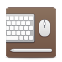

#  Workspaces

Make working on different projects easy again!

Workspaces lets you configure and quickly launch all you need to work on a project. It can open in a second different instances of code, a specific website and a directory.
  


## Motivation
I normally work on different projects throught the day, and some of them require a lot of apps to have open, they have different urls etc.

With Workspaces I'm able with a click to open all the stuff I need for a project. I can also check links for github, isues etc for the projects.

I used to use the [Workspaces](https://www.apptorium.com/workspaces) app for mac and I made it very similar.

## Installation

### elementary OS
[](https://appcenter.elementary.io/com.github.devalien.workspaces)

This app is available on the elementary OS AppCenter.

# Install it from source

You can of course download and install this app from source.

## Dependencies

Ensure you have these dependencies installed

* granite
* gtk+-3.0
* json-glib-1.0
* libgee-0.8
* meson
* vala
* ninja

## Install, build and run

```bash
# install elementary-sdk, meson and ninja 
sudo apt install elementary-sdk meson ninja
# clone repository
git clone git@github.com:DevAlien/workspaces.git workspaces
# cd to dir
cd workspaces
# run meson
meson build --prefix=/usr
# cd to build, build and test
cd build
sudo ninja install && com.github.devalien.workspaces
```

## Generating pot file

```bash
# after setting up meson build
cd build

# generates pot file
sudo ninja com.github.devalien.workspaces-pot

# to regenerate and propagate changes to every po file
sudo ninja com.github.devalien.workspaces-update-po
```

## Thanks/Credits

- [Workspaces](https://www.apptorium.com/workspaces) Where I got the idea.
- [Tuner](https://github.com/louis77/tuner) The creator of this app inspired me to build one myself.
- [Clipped](https://github.com/davidmhewitt/clipped) I took inspiration for the Quick Launch from this app.
- [AppEditor](https://github.com/donadigo/appeditor) Copied the edit part of the app, I will iterate over it in the next releases.
